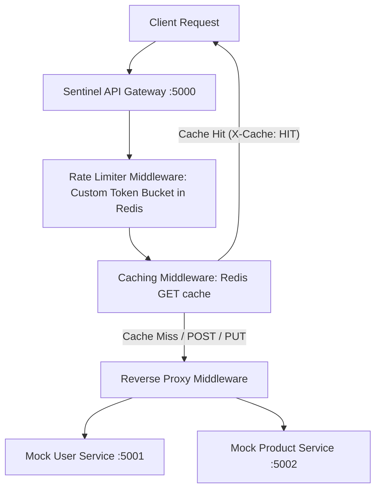

# Sentinel: Distributed API Gateway & Rate Limiter 🛡️

Sentinel is a high-performance API Gateway, Reverse Proxy, Caching, and Rate Limiting system built from scratch using Node.js, Express, and Redis. It is designed to act as a single entry point for client requests, protecting and directing requests to backend microservices.

---

## 🏗️ System Architecture



---

## ✨ Key Features

1.  **Dynamic Reverse Proxy Routing:** Parses routing rules and maps client URL paths (e.g., `/users/*` or `/products/*`) directly to target microservice hosts.
2.  **Custom Token Bucket Rate Limiter:** An atomic, Redis-backed rate limiting implementation using a Lua script to prevent race conditions during high-concurrency request bursts.
3.  **Intelligent Cache Store:** Stores GET responses inside Redis with configurable Time-To-Live (TTL) values. Intercepts proxy response payloads and automatically serves subsequent requests from cache (setting the `X-Cache: HIT` header).
4.  **Graceful Fallback Mode:** If the connection to the Redis server fails, Sentinel automatically falls back to an internal, in-memory store so the gateway remains active.

---

## ⚙️ How the Token Bucket Algorithm Works

Sentinel implements the **Token Bucket Algorithm** for rate limiting. 
*   **Tokens:** A bucket holds a maximum capacity of tokens (e.g., 10 tokens).
*   **Consumption:** Each incoming request consumes 1 token. If no tokens are left, the request is rejected with HTTP `429 Too Many Requests`.
*   **Refill:** Tokens are refilled at a linear rate over time (e.g., refilling 1 token every 6 seconds) up to the maximum capacity.
*   **Atomicity:** To ensure correct behavior when multiple application instances access the same bucket, the refill, checks, and decrements are performed in a single **Redis Lua script**. This prevents race conditions where double consumption might slip past the limit.

---

## 🚀 Running the Project

### 1. Prerequisites
*   Node.js (v18+)
*   Redis Server (Running locally on `127.0.0.1:6379`)
    *(Note: If Redis is not running, Sentinel will print a warning and fallback to in-memory mode automatically).*

### 2. Setup
Clone/navigate to the folder and install dependencies:
```bash
npm install
```

### 3. Start Mock Microservices
Open two terminal windows and start the mock downstream services:
```bash
# Terminal 1: Start User Service on port 5001
npm run service:users

# Terminal 2: Start Product Service on port 5002
npm run service:products
```

### 4. Start the Sentinel API Gateway
Start the gateway on port 5000:
```bash
# Terminal 3: Start Gateway
npm start
```

---

## 🧪 Testing and Verification

### 1. Reverse Proxying
Send a request to the gateway on port 5000:
```bash
curl http://localhost:5000/users/profile
```
**Response:** You should see data returned from the User Service (`:5001`) with the gateway logging the duration.

### 2. Caching Verification
Request the product list:
```bash
curl -I http://localhost:5000/products/list
```
*   **First Request:** Returns `X-Cache: MISS` (and records the database timestamp).
*   **Second Request (within 15s):** Returns `X-Cache: HIT` (timestamp remains identical).

### 3. Rate Limiting Verification
The `/products` route is configured for a maximum of 5 requests per minute.
Run this command to send 6 rapid requests:
```bash
for i in {1..6}; do curl -s -o /dev/null -w "%{http_code}\n" http://localhost:5000/products/list; done
```
**Output:**
```text
200
200
200
200
200
429
```
The 6th request will be blocked with `429 Too Many Requests`.
