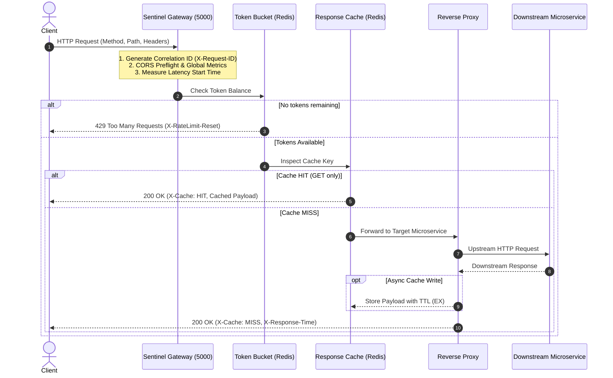

# Sentinel API Gateway: Code Architecture & Technical Guide 🛡️

This documentation series provides an in-depth breakdown of the architecture, design patterns, algorithmic implementations, and operational mechanics of the **Sentinel API Gateway**.

## Series Index

| Part | Document | Focus Area | Key Modules |
| :--- | :--- | :--- | :--- |
| **01** | [Gateway Architecture & Pipeline Lifecycle](./01-gateway-pipeline.md) | Request lifecycle, global middlewares, route dispatching | `src/gateway.js` |
| **02** | [Token Bucket Rate Limiting](./02-token-bucket-rate-limiter.md) | Atomic Lua scripting, bucket refill, distributed concurrency | `src/middlewares/rateLimiter.js` |
| **03** | [Response Caching Subsystem](./03-response-caching.md) | Cache keys, Redis TTL, header restoration, asynchronous write-back | `src/middlewares/cache.js` |
| **04** | [Reverse Proxy & Routing Engine](./04-reverse-proxy.md) | Path rewriting, header decorating, error isolation, upstream routing | `src/middlewares/proxy.js` |
| **05** | [Observability, Metrics & Telemetry](./05-metrics-and-observability.md) | Latency tracking, status code distribution, access logging | `src/middlewares/metrics.js` |
| **06** | [Microservices & End-to-End Testing](./06-microservices-and-integration-tests.md) | Mock services, integration verification, restaurant lifecycle | `scripts/test-restaurant.js` |

---

## High-Level Request Pipeline

